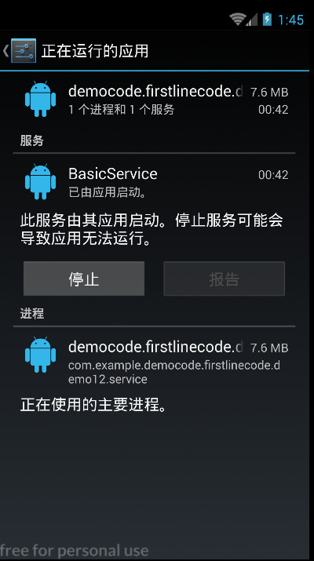

##### 项目说明
* 采用UTF-8编码.
* Android服务技术的讲解使用.

##### MainActivity.java
* 主界面
* 1.Android多线程编程.
* 2.Android服务的基本用法.
* 3.Android服务的实践--后台执行定时任务.

##### AndroidThreadBasicUsage.java
* 线程的三种使用方式.
* 接口式,继承式,匿名内部类式.

##### AndroidThreadActivity.java
* 1.在子线程中更新UI.
* 2.解析异步消息处理机制.
* 3.使用AsyncTask. 

##### AndroidThreadAsynchronous.java
* 用于在子线程当中更新Android UI部分,使用Android异步处理技术来解决这个技术难点.

##### AndroidThreadAsyncTask.txt
* 主要讲解了使用AsyncTask的部分.

##### AndroidServiceJieMianActivity.java
* 1.启动停止BasicService

##### BasicService.java
* 基本的Android服务的形式,实现的方法,当用户点击启动服务或停止服务时都会在Logcat插件当中进行输出.

